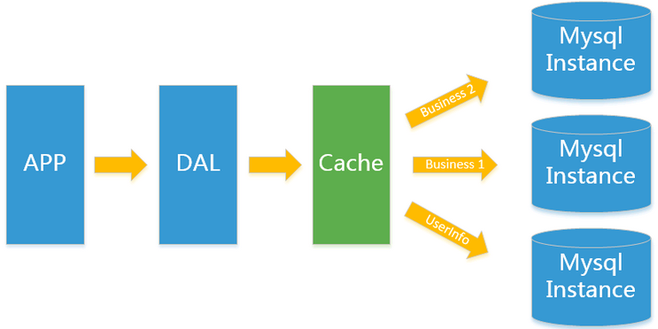
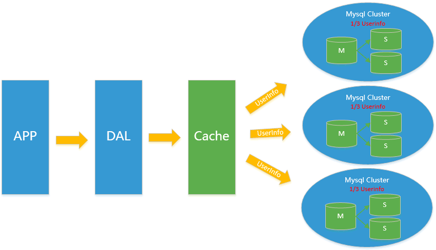

# NoSql入门和概述

## 入门概述

### Nosql的发展史

#### --单机MySQL

在90年代，一个网站的访问量一般都不大，用单个数据库完全可以轻松应付。
在那个时候，更多的都是静态网页，动态交互类型的网站不多。


上述架构下，我们来看看数据存储的瓶颈是什么？

1. 数据量的总大小 一个机器放不下时
2. 数据的索引（B+ Tree）一个机器的内存放不下时
3. 访问量(读写混合)一个实例不能承受
    																			如果满足了上述1 or 3个，进化......


#### --Memcached(缓存)+MySQL+垂直拆分

>垂直拆分其实就是增加新的MySQL服务器

后来，随着访问量的上升，几乎大部分使用MySQL架构的网站在数据库上都开始出现了性能问题，web程序不再仅仅专注在功能上，同时也在追求性能。程序员们开始大量的使用缓存技术来缓解数据库的压力，优化数据库的结构和索引。开始比较流行的是通过文件缓存来缓解数据库压力，但是当访问量继续增大的时候，多台web机器通过文件缓存不能共享，大量的小文件缓存也带了了比较高的IO压力。在这个时候，Memcached就自然的成为一个非常时尚的技术产品。



Memcached作为一个独立的分布式的缓存服务器，为多个web服务器提供了一个共享的高性能缓存服务，在Memcached服务器上，又发展了根据hash算法来进行多台Memcached缓存服务的扩展，然后又出现了一致性hash来解决增加或减少缓存服务器导致重新hash带来的大量缓存失效的弊端


#### --Mysql主从读写分离

由于数据库的写入压力增加，Memcached只能缓解数据库的读取压力。读写集中在一个数据库上让数据库不堪重负，大部分网站开始使用主从复制技术来达到读写分离，以提高读写性能和读库的可扩展性。Mysql的master-slave模式成为这个时候的网站标配了。


#### --分表分库+水平拆分+mysql集群 

 在Memcached的高速缓存，MySQL的主从复制，读写分离的基础之上，这时MySQL主库的写压力开始出现瓶颈，而数据量的持续猛增，由于MyISAM使用表锁，在高并发下会出现严重的锁问题，大量的高并发MySQL应用开始使用InnoDB引擎代替MyISAM。



同时，开始流行使用分表分库来缓解写压力和数据增长的扩展问题。这个时候，分表分库成了一个热门技术，是面试的热门问题也是业界讨论的热门技术问题。也就在这个时候，MySQL推出了还不太稳定的表分区，这也给技术实力一般的公司带来了希望。虽然MySQL推出了MySQL Cluster集群，但性能也不能很好满足互联网的要求，只是在高可靠性上提供了非常大的保证。


#### --今天是什么样子

- 问题：MySQL的扩展性瓶颈

MySQL数据库也经常存储一些大文本字段，导致数据库表非常的大，在做数据库恢复的时候就导致非常的慢，不容易快速恢复数据库。比如1000万4KB大小的文本就接近40GB的大小，如果能把这些数据从MySQL省去，MySQL将变得非常的小。关系数据库很强大，但是它并不能很好的应付所有的应用场景。MySQL的扩展性差（需要复杂的技术来实现），大数据下IO压力大，表结构更改困难，正是当前使用MySQL的开发人员面临的问题。

- 解决：使用多种NoSQL


#### --为什么使用NoSQL ?

今天我们可以通过第三方平台（如：Google,Facebook等）可以很容易的访问和抓取数据。用户的个人信息，社交网络，地理位置，用户生成的数据和用户操作日志已经成倍的增加。我们如果要对这些用户数据进行挖掘，那SQL数据库已经不适合这些应用了, NoSQL数据库的发展也却能很好的处理这些大的数据。


### 是什么

**NoSQL(NoSQL = Not Only SQL )，意即“不仅仅是SQL”**，泛指非关系型的数据库。随着互联网web2.0网站的兴起，传统的关系数据库在应付web2.0网站，特别是超大规模和高并发的SNS类型的web2.0纯动态网站已经显得力不从心，暴露了很多难以克服的问题，而非关系型的数据库则由于其本身的特点得到了非常迅速的发展。NoSQL数据库的产生就是为了解决大规模数据集合多重数据种类带来的挑战，尤其是大数据应用难题，包括超大规模数据的存储。


### NoSQL的优点

1. **易扩展**

   NoSQL数据库种类繁多，但是一个共同的特点都是去掉关系数据库的关系型特性。
   数据之间无关系，这样就非常容易扩展。也无形之间，在架构的层面上带来了可扩展的能力。

2. **大数据量高性能**

   NoSQL数据库都具有非常高的读写性能，尤其在大数据量下，同样表现优秀。
   这得益于它的无关系性，数据库的结构简单。

   一般MySQL使用Query Cache，每次表的更新Cache就失效，是一种大粒度的Cache，
   在针对web2.0的交互频繁的应用，Cache性能不高。而NoSQL的Cache是记录级的，
   是一种细粒度的Cache，所以NoSQL在这个层面上来说就要性能高很多了

3. **多样灵活的数据模型**

   NoSQL无需事先为要存储的数据建立字段，随时可以存储自定义的数据格式。而在关系数据库里，
   增删字段是一件非常麻烦的事情。如果是非常大数据量的表，增加字段简直就是一个噩梦

4. **传统RDBMS vs NoSQL**

RDBMS

- 高度组织化结构化数据
- 结构化查询语言（SQL）
- 数据和关系都存储在单独的表中。
- 数据操纵语言，数据定义语言
- 严格的一致性
- 基础事务

NoSQL

- 代表着不仅仅是SQL
- 没有声明性查询语言
- 没有预定义的模式
-键 - 值对存储，列存储，文档存储，图形数据库
- 最终一致性，而非ACID属性
- 非结构化和不可预知的数据
- CAP定理
- 高性能，高可用性和可伸缩性

## 3V+3高

**大数据时代的3V**

- 海量Volume

- 多样Variety

- 实时Velocity

**互联网需求的3高**

- 高并发

- 高可扩

- 高性能

## 当下的NoSQL经典应用

>当下的应用是sql和nosql一起使用

### 举例


- **商品基本信息**

  使用关系型数据库（MySQL存储）

- **商品描述、详情、评价(多文字类)**

  文档数据库MongDB中

- **商品的图片**

  淘宝自己的TFS

- **商品的关键字**

  ISearch

- **商品的波段性的热点高频信息**

  Redis

- **商品的交易、价格计算、积分累计**

  外部系统，外部第3方支付接口

## NoSQL数据库的四大分类

#### KV键值

- 新浪：BerkeleyDB+redis

- 美团：redis+tair

- 阿里、百度：memcache+redis

#### 文档型数据库(bson格式比较多)

- CouchDB

- MongoDB

	MongoDB 是一个基于分布式文件存储的数据库。由 C++ 语言编写。旨在为 WEB 应用提供可扩展的高性能数据存储解决方案。
	MongoDB 是一个介于关系数据库和非关系数据库之间的产品，是非关系数据库当中功能最丰富，最像关系数据库的。

#### 列存储数据库

- Cassandra, HBase

```
分布式文件系统
```

#### 图关系数据库

- Neo4J, InfoGrid

```1
它不是放图形的，放的是关系比如:朋友圈社交网络、广告推荐系统

社交网络，推荐系统等。专注于构建关系图谱
```


#### 四者对比 


## 在分布式数据库中CAP原理CAP+BASE

### CAP是什么

- C:Consistency（强一致性）

- A:Availability（可用性）

- P:Partition tolerance（分区容错性）


### 经典CAP图


CAP理论的核心是：一个分布式系统不可能同时很好的满足一致性，可用性和分区容错性这三个需求，
最多只能同时较好的满足两个。
因此，根据 CAP 原理将 NoSQL 数据库分成了满足 CA 原则、满足 CP 原则和满足 AP 原则三 大类：

- CA - 单点集群，满足一致性，可用性的系统，通常在可扩展性上不太强大。
- CP - 满足一致性，分区容忍性的系统，通常性能不是特别高。
- AP - 满足可用性，分区容忍性的系统，通常可能对一致性要求低一些。


### CAP的3进2

CAP理论就是说在分布式存储系统中，最多只能实现上面的两点。

而由于当前的网络硬件肯定会出现延迟丢包等问题，所以分区容忍性是我们必须需要实现的。

**所以我们只能在一致性和可用性之间进行权衡，没有NoSQL系统能同时保证这三点。**

分布式架构的时候必须做出取舍。

一致性和可用性之间取一个平衡。多余大多数web应用，其实并不需要强一致性。

**因此牺牲C换取P，这是目前分布式数据库产品的方向**

---

> 一致性与可用性的决择

对于web2.0网站来说，关系数据库的很多主要特性却往往无用武之地

1. **数据库事务一致性需求** 
   　　很多web实时系统并不要求严格的数据库事务，对读一致性的要求很低， 有些场合对写一致性要求并不高。允许实现最终一致性。

2. **数据库的写实时性和读实时性需求**
   　　对关系数据库来说，插入一条数据之后立刻查询，是肯定可以读出来这条数据的，但是对于很多web应用来说，并不要求这么高的实时性，比方说发一条消息之 后，过几秒乃至十几秒之后，我的订阅者才看到这条动态是完全可以接受的。

3. **对复杂的SQL查询，特别是多表关联查询的需求** 
   　　任何大数据量的web系统，都非常忌讳多个大表的关联查询，以及复杂的数据分析类型的报表查询，特别是SNS类型的网站，从需求以及产品设计角 度，就避免了这种情况的产生。往往更多的只是单表的主键查询，以及单表的简单条件分页查询，SQL的功能被极大的弱化了。

### BASE

> BASE就是为了解决关系数据库强一致性引起的问题而引起的可用性降低而提出的解决方案。

BASE其实是下面三个术语的缩写：

- 基本可用（Basically Available）
- 软状态（Soft state）
- 最终一致（Eventually consistent）

它的思想是通过让系统放松对某一时刻数据一致性的要求来换取系统整体伸缩性和性能上改观。

为什么这么说呢，缘由就在于大型系统往往由于地域分布和极高性能的要求，不可能采用分布式事务来完成这些指标，要想获得这些指标，我们必须采用另外一种方式来完成，这里BASE就是解决这个问题的办法

### 分布式+集群简介

**分布式系统（distributed system）**
由多台计算机和通信的软件组件通过计算机网络连接（本地网络或广域网）组成。分布式系统是建立在网络之上的软件系统。正是因为软件的特性，所以分布式系统具有高度的内聚性和透明性。因此，网络和分布式系统之间的区别更多的在于高层软件（特别是操作系统），而不是硬件。分布式系统可以应用在在不同的平台上如：Pc、工作站、局域网和广域网上等。


简单来讲：

- 分布式：不同的多台服务器上面**部署不同的服务模块**（工程），他们之间通过Rpc/Rmi之间通信和调用，对外提供服务和组内协作。

- 集群：不同的多台服务器上面**部署相同的服务模块**，通过分布式调度软件进行统一的调度，对外提供服务和访问。
